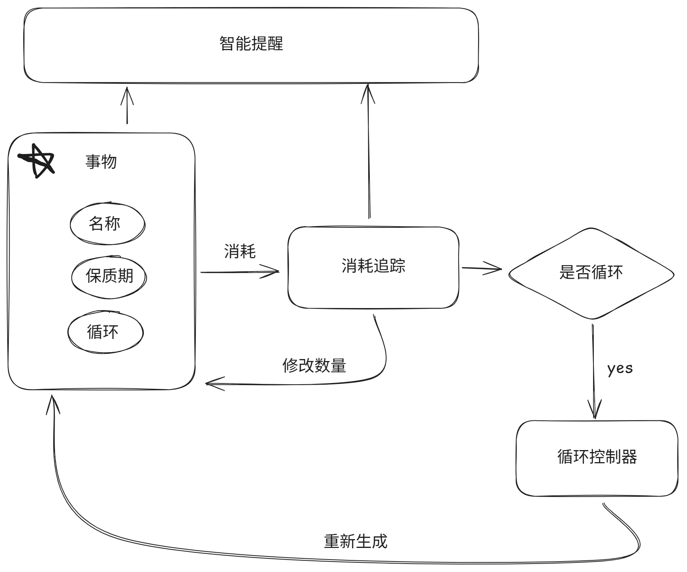

# ShelfLife

> 🧠 ShelfLife 是一款帮助你记录生活中所有"有时间效期"的事物的轻量级应用。<br>无论是冰箱里会过期的苹果、还是每周要完成的骑行充气，<br>在 ShelfLife 中它们都是"一个有有效期的条目"，你只需记录一次，系统会帮你记住、提醒、循环。

> 不知道从什么时候开始，在每一个东西上面都有个日子，秋刀鱼会过期，肉酱也会过期，连保鲜纸都会过期。————《重庆森林》

本项目用 cursor ai 开发，详情参考[ai 开发文档](./docs/ai-dev.md)

## 🌱 核心理念

在 ShelfLife 中，一切需要你"在某个时间点前完成"或"在某个时间后更新"的东西，都是统一的概念：有"保质期"的事物。

我们不区分"物品"或"任务"，它们本质相同：

- 苹果：有效期是某日（过期即提醒）
- 蚊香贴：有效期是 15 天后（循环生成，并且生成后减少数量）
- 吃药：有效期是一天后（循环生成，并且生成后减少数量）
- 每周自行车充气：有效期是一周后（循环生成）
- 汽车保养维护：有效期是一年后（循环生成）

---

## 🧩 核心功能

### ✅ 事物管理（Thing = 有效期 + 内容）

每个条目由以下组成：

- **名称**（如"苹果"、"吃药"、"自行车充气"）
- **有效期**（如"7 月 10 号 06:00:00"）
- **是否循环**（可选：每天/每周/每月/自定义周期）
- **剩余数量**（可选：1）
- **所处位置**（如"冰箱"、"杂物箱"、"杂事"）

### 🧂 消耗追踪器

- 支持记录每次"使用"行为（数量 + 时间）
- 自动扣除事物中的剩余库存（如设置了初始数量）
- 每日 / 每周 / 每月 / 每年的消耗量分析
- 剩余量预估：结合消耗速度预测用完时间

### 🔁 自动循环控制器

- 设置为"循环"的条目，消耗后会自动生成下一条
- 不需要你手动重复添加
- 记录每一次的完成历史

### 🔔 智能提醒

- 系统会根据有效期自动提醒你
- 即将过期：提前一天通知
- 当天到期：高亮/推送提示

---

## 📊 架构图



---

## 🛠 技术栈

- **前端：** Vite + React + TypeScript + Material UI
- **后端：** NestJS + Prisma + PostgreSQL
- **提醒系统：** Webhook / 邮件
- **部署：** Docker 支持，适合自托管

---

## 🚀 快速开始

### 环境要求

- Node.js 18+
- PostgreSQL 12+
- npm 或 yarn

### 后端启动

1. 进入后端目录：

```bash
cd backend
```

2. 安装依赖：

```bash
pnpm install
```

3. 配置环境变量：

```bash
cp .env.example .env
# 编辑 .env 文件，配置数据库连接
```

4. 初始化数据库：

```bash
pnpm run prisma:generate
pnpm run prisma:migrate
```

5. 启动开发服务器：

```bash
pnpm run start:dev
```

后端服务将在 http://localhost:3000 启动，API 文档地址：http://localhost:3000/docs

### 前端启动

1. 进入前端目录：

```bash
cd frontend
```

2. 安装依赖：

```bash
npm install
```

3. 启动开发服务器：

```bash
npm run dev
```

前端应用将在 http://localhost:5173 启动

---

## 📝 使用说明

1. **添加事物**：点击右上角"添加事物"按钮，填写事物信息
2. **设置循环**：开启"循环提醒"开关，设置循环间隔
3. **消耗记录**：对于可消耗的事物，点击减号按钮记录消耗
4. **标签筛选**：使用标签筛选器查看特定类别的事物
5. **过期提醒**：系统会自动检查并提醒即将过期的事物

---

## 🔧 开发说明

### 项目结构

```
shelflife/
├── backend/                 # 后端代码
│   ├── src/
│   │   ├── things/         # 事物管理模块
│   │   ├── tags/           # 标签管理模块
│   │   ├── consumption/    # 消耗记录模块
│   │   ├── notification/   # 通知模块
|   |   ├── recurring/      # 循环模块
│   │   └── prisma/         # 数据库服务
│   └── prisma/
│       └── schema.prisma   # 数据库模型
├── frontend/               # 前端代码
│   ├── src/
│   │   ├── components/     # React 组件
│   │   ├── services/       # API 服务
│   │   └── types/          # TypeScript 类型定义
│   └── public/             # 静态资源
└── docs/                   # 项目文档
    └── 需求文档.md         # 详细需求说明
```

### API 接口

- `GET /api/things` - 获取事物列表
- `POST /api/things` - 创建新事物
- `GET /api/things/:id` - 获取事物详情
- `PATCH /api/things/:id` - 更新事物
- `DELETE /api/things/:id` - 删除事物
- `POST /api/consumption/:thingId` - 消耗事物
- `GET /api/tags` - 获取标签列表

---

## 许可证

MIT License
